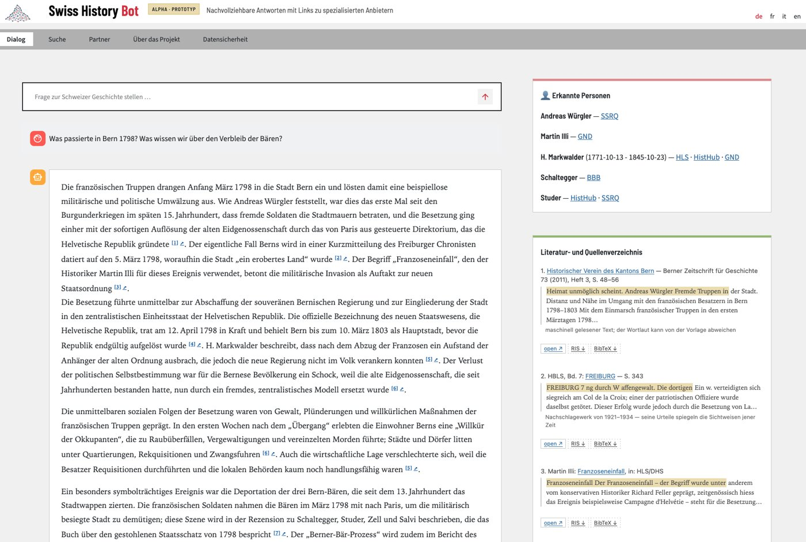
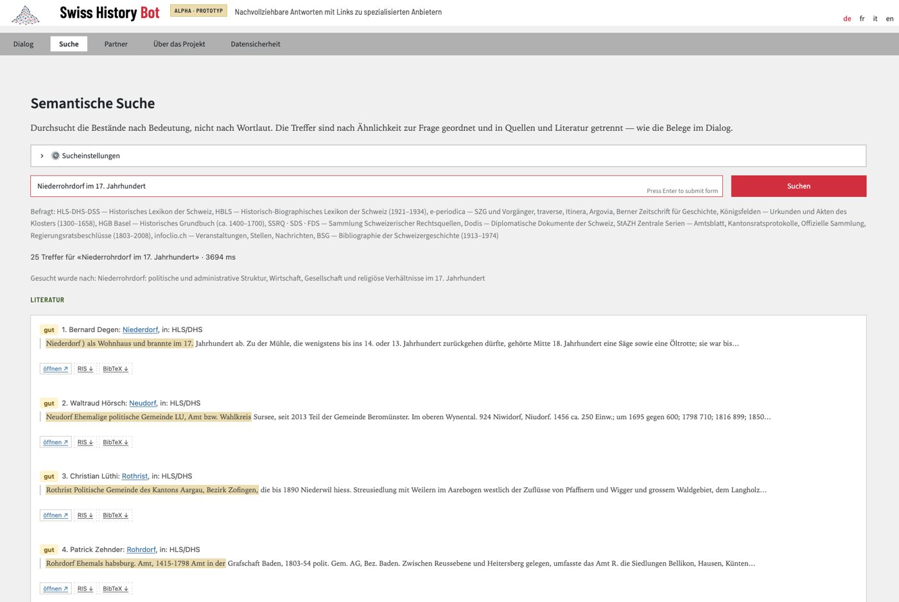

## LLM, Bot, Agent – eine Arbeitsunterscheidung

| Begriff | Was es ist | Beispiel |
|------------------|---------------------------|---------------------------|
| **LLM** (Large Language Model) | Ein Modell, das auf Basis von Wahrscheinlichkeiten Text (und zunehmend Bild, Ton, Code) erzeugt. Es «weiss» nichts, sondern setzt Muster fort. | gpt-oss-120b, Gemini, Claude, Llama |
| **Bot** | Eine Anwendung um ein LLM herum, die auf Eingaben antwortet – oft mit festen Anweisungen und eigenen Dokumenten (RAG). Der Mensch löst jeden Schritt aus. | eigener GPT, NotebookLM, Swiss History Bot |
| **Agent** | Ein System, das ein Ziel in Teilschritte zerlegt und dafür **selbständig Werkzeuge nutzt**: Dateien lesen und schreiben, im Web suchen, Code ausführen, andere Agenten beauftragen – auch zeitgesteuert, ohne dass jemand zuschaut. | Agentic Coding (Claude Code, Codex, Cursor), OpenClaw, Agentic Historian |

Die Übergänge sind fliessend. Entscheidend für den kritischen Umgang ist die Frage: **Wer
kontrolliert welchen Schritt – und was sieht der Anbieter dabei?**

## Einstieg: Swiss History Bot {#swiss-history-bot}

Gleich nach der Vorstellungsrunde testen wir den **Swiss History Bot** (Alpha-Prototyp), eine Anwendung auf
Infrastruktur der Digital Humanities: <https://tei.dh.unibe.ch/history-bot/> (zugangsgeschützt,
den Zugang erhalten Sie in der Sitzung). Der Bot verspricht «nachvollziehbare Antworten mit Links
zu spezialisierten Anbietern».

{fig-alt="Screenshot des Swiss History Bot im Dialog-Modus: Eine Frage zu Bern 1798 wird mit Fussnoten beantwortet; rechts erkannte Personen mit Links zu HLS, GND, HistHub, SSRQ sowie ein Literatur- und Quellenverzeichnis."}

Im **Dialog** beantwortet der Bot Fragen mit Fussnoten. Rechts stehen das Literatur- und
Quellenverzeichnis (mit Fundstelle und Export als RIS/BibTeX) und die erkannten Personen, verknüpft
mit HLS, GND, HistHub oder SSRQ. Hinweise wie «maschinell gelesener Text» oder «Nachschlagewerk von
1921–1934 – seine Urteile spiegeln die Sichtweisen jener Zeit» gehören zur Quellenkritik.

{fig-alt="Screenshot der semantischen Suche des Swiss History Bot mit der Anfrage «Niederrohrdorf im 17. Jahrhundert» und den Treffern Niederdorf, Neudorf, Rothrist und Rohrdorf aus dem HLS."}

Die **Suche** durchsucht die Bestände (u. a. HLS, HBLS, e-periodica, Königsfelden, Historisches
Grundbuch Basel, Rechtsquellen, Dodis, Staatsarchiv Zürich, infoclio.ch, Bibliographie der
Schweizergeschichte) nach Bedeutung statt nach Wortlaut. Das Beispiel zeigt, wo das an Grenzen
stösst: Auf «Niederrohrdorf im 17. Jahrhundert» folgen Niederdorf, Neudorf und Rothrist – ähnlich
klingend, aber nicht gemeint.

### Ausprobieren (13:25–13:40)

1.  **Dialog:** Stellen Sie eine Frage zu einem Thema, das Sie gut kennen. Öffnen Sie mindestens
    zwei Fussnoten: Steht in der Quelle, was die Antwort behauptet?
2.  **Suche:** Suchen Sie einen Ort oder eine Person mit Zeitraum. Wie viele der ersten zehn
    Treffer passen wirklich? Wo führt «Ähnlichkeit» in die Irre?
3.  **Grenzen:** Fragen Sie nach etwas, das kaum belegt ist. Sagt der Bot, dass er es nicht weiss
    – oder erfindet er etwas? Stimmen die Links bei den erkannten Personen?

Notieren Sie Ihre Beobachtungen – wir kommen im Input und am Schluss darauf zurück: Was kann der Bot gut, wo stösst
er an Grenzen, und was fehlt noch, damit aus dem Bot ein Agent wird?

## Agentic Historian

[Agentic Historian](https://github.com/thodel/agentic-historian) ist ein Multi-Agenten-System für
die Erschliessung historischer Quellen, gesteuert über einen Chat (Discord). Ein Orchestrator
verteilt die Arbeit auf spezialisierte Agenten:

``` text
Chat (Discord)
   └── Orchestrator
         ├── Agent A – Texterkennung (HTR mit einem multimodalen Modell)
         ├── Agent B – Quellenbeschreibung (Klassifikation, Schlagworte)
         ├── Agent C – Entitäten extrahieren und verknüpfen (Wikidata, GND)
         ├── Agent D – Korpusanalyse (Topics, Taxonomien, Voyant)
         └── Agent E – Meta-Agent (Ressourcen, Kosten, Verbesserungsvorschläge)
                └── Knowledge Hub (kontrolliertes Vokabular, Personen, Orte, Dokumenttypen)
```

Was daran für den kritischen Umgang lehrreich ist:

-   **Historiker:in im Loop:** Der Knowledge Hub wird von Menschen gepflegt und steuert, wie die
    Agenten klassifizieren und verknüpfen.
-   **Prüfbarkeit:** Alle Zwischenergebnisse werden als Markdown/JSON abgelegt und sind
    nachvollziehbar.
-   **Kosten und Ressourcen** werden von einem eigenen Agenten überwacht – sie sind Teil der
    Methode, nicht eine Nebensache.
-   **Austauschbarkeit:** Jeder Agent kann auf ein anderes Modell umgestellt werden, auch auf ein
    lokales (z. B. über GPUStack).

## Agenten im Alltag: Chancen und Risiken

-   **Model Context Protocol (MCP):** standardisierte Schnittstelle, über die Modelle auf
    Dokumente, Datenbanken und Programme zugreifen. Konsequenz: Die **Daten gehen an das Modell –
    also an den Anbieter**.
-   **Agentic Coding:** Ideen lassen sich in Minuten als Prototyp umsetzen und direkt
    veröffentlichen (z. B. über GitHub Pages). Offen bleiben Codequalität, Stabilität und
    langfristige Wartbarkeit. *Prototyp: ja – langfristige Implementation: nein.*
-   **Persönliche Agenten** (z. B. OpenClaw): Zugriff auf Dateisysteme, Mail und Kalender,
    Steuerung über Chat, Aktionen per Zeitplan. Mächtig – und ein **potenzielles
    Sicherheitsdesaster**, wenn Zugriffsrechte und Anweisungen nicht klar begrenzt sind.
